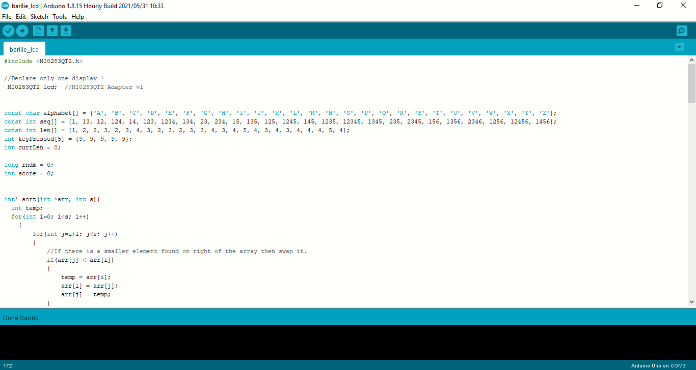

# Braille Trainer

## Outline
- Problem
- Introduction
- Why do we use Braille?
- Methodology
- Circuit Design
- Component Requirment

# Problem
The task is to develop a training application for braille using an Arduino. Connect a display as well as 6 buttons to the Arduino. The buttons will be arranged in a 2x3 grid representing one braille letter. The display will present a letter which has to be entered using the braille keyboard by pressing the right set of buttons at the same time. The display shows the results (right vs. wrong). Think of a score system (e.g. the trainee has n lives before the game ends and gets points for each correct letter). 
  

# Introduction
Braille is a tactile reading and writing system, but mainly used by blind people and those who are visually impaired. Raised dots are used to represent letters of the alphabet, punctuation, music, and even mathematical and scientific symbols.

Contrary to popular belief, braille is not its own language but rather an alternative set of symbols, like a code. Because of this, braille can be developed for any language.

# Why and where do human use Braille?
__[According to the NHS](https://www.nhs.uk/conditions/vision-loss/)__, there are almost 2 million people in the UK who suffer from sight loss; of this, 360,000 are registered as blind or partially sighted. And yet, there are only around 12,000 people in the UK who read braille.

One of the biggest myths when it comes to learning braille is that it will be too hard, but the truth is it doesn’t have to be. Most people who suffer from visual impairment have had it develop later in life, so learning a new “language” can seem pointless, especially with advances in technology. However, this simply isn’t the case

# Methodology
Braille Trainer consist of 3 Major parts along with it’s other components and these components interact with each other accordingly the given instruction. 

1. On start LCD will Display Welcome Statement or Game start statement
2. LCD will display any alphabetic letter on screen like Z,A,C,D.
3. After Display of alphabetic letter user 4. will insert the code of respective letter using button 6 buttons attach with it.
4. If user press the correct combinations of button display will show answer correct and 10 points will be given to user.
5. On wrong answers there will be 3 tries for user After three attempts game will be over
On game ending user will see the screen back to start position
User have n number of lives.

# Circuit Design
 

# Component Requirment
To develop whole system we need list of components given below

1. Arduino Uno With Complete Box
2. 6 Button Keyboard or only Buttons
3. Display Watterott MI0283QT-2
4. Wires
5. Breadboard
6. 6 Resistors of 1k ohm and 3.9k ohm (Both Required)

# References
1. Image source: 
https://supercarers.com/blog/learning-braille-later-in-life
2. https://www.nhs.uk/conditions/vision-loss/
3. https://www.resna.org/sites/default/files/legacy/conference/proceedings/2004/Papers/StudentDesign/Winners/BrailleTrainer.html

# Implementation Phase
## Arduino Code implementation and results 
- Screen Start with random numbers
- Six Button facility on screen or can be attached externally on bread board (code for both option is available)
- On Starting screen random alphabets apears then actual Game/program start
- User enter specific code for the given alphabet either through screen of external buttons
- Program checks the combination if it is entered correctly or not 
- Wrong entry of program will end the game and restart it.
- Right Entry gives point to user and continue the game until the wrong combination is entered.
- User have n lives and can play as much as he wants.

# Screenshot of Code with on touch compatibility
 

# Screenshot of Code with external button compatibility
 

# Intallation Guide
1. Click the Clone or Download button above and download the zip, or if you are a github user, clone this repo, or fork it!
2. Unzip arduino_braille_trainer.zip in your Documents/Arduino folder. This properly installs your files.
3.  

